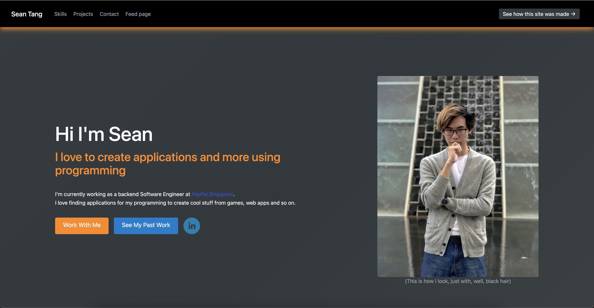

This is a [Next.js](https://nextjs.org/) project bootstrapped with [`create-next-app`](https://github.com/vercel/next.js/tree/canary/packages/create-next-app).



## Getting Started

First, run the development server:

```bash
npm run dev
# or
yarn dev
```

Open [http://localhost:3000](http://localhost:3000) with your browser to see the result.

## What is this project about ?

This repository will house the successor to both the [front-end](https://github.com/SeanEvanss/react_portfolio_site) and [middleware](https://github.com/SeanEvanss/portfolio_site_backend) of my pprtfolio page. The main reason for the transition was because as more itnerative development took place, I realised it would be easier to intergate and add new features if I used a framework such as NEXTJs that allows me to handle both front-end and middleware code from one code base. 

## What are new features that can be expected ?

1. Static site generation.
    - Because my site does have some media resources, I recognised that it could benefit the end user experience if we capitlaise on NEXT's ability to provide static site generation

2. Social feed functionality
    - One of the features I added near the tailend of the original front-end site's commit hisotry was a feed page that tailored to show posts that I made with regards to personal projects I was making. The old approach was the edit the source code everytime I wanted to make a new post.

    Terrible idea.

    I thus always planned to use something like firebase/redis to allow me to easily add content and have the site load content dynamically from there. This potentially required Auth0 as well as firebase/redis access which generally should be done at the middle ware layer (preferably anyway).

    As an added bonus I can take advantage of the server side rendering capibilites offered by NEXT framework.

3. Vercel
    - Vercel is created as a hosting platform for NEXTJs project by, well, the people who created NEXTJs. It not allows hobbyist-tier hosting but it allows us to take full advantage of NEXTJs projects features, unlike github pages. Furthermore, it also acts as a CI?CD pipeline right out of the box, very useful.

## When will this be done ?
   The short answer is I have no idea. 

   The somewhat longer answer is that I have no idea because beyond copy pasting my code, I need to ensure the code functions as is without any issues as well as improving old portions of my code. So yea.

